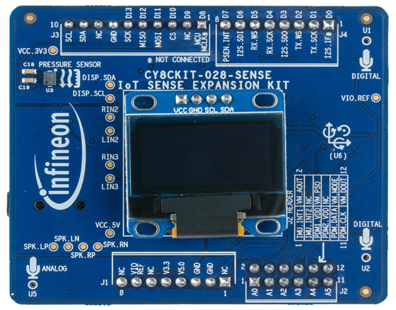

# CY8CKIT-028-SENSE shield support library

The Sense Shield Board (CY8CKIT-028-SENSE) has been designed as a companion to add common sensors, audio components and user interface to an Arduino based baseboard.

This kit targets two main applications:
* Audio Applications: The kit includes two PDM microphones and one analog microphone. It also has an audio codec with audio jack connector.
* Machine Learning (ML) Applications: The kit includes multiple sensors to generate input data to feed ML algorithms, such as a 9-axis sensor, a pressure and temperature sensor, or even the microphones.

* OLED Display (SSD1306)
* Orientation Sensor (BMX-160)
* XENSIV Pressure & Temperature Sensor (DPS310XTSA1)
* 2 XENSIV MEMS Microphones (IM69D130V01XTSA1)
* PDM Microphone example code (SPK0838HT4HB)
* Audio Codec (WM8960)

The shield library provides support for:
* Initializing/freeing all of the hardware peripheral resources on the board
* Defining all pin mappings from the Arduino interface to the different peripherals
* Providing access to each of the underlying peripherals on the board

This library makes use of support libraries: [display-oled-ssd1306](https://github.com/cypresssemiconductorco/display-oled-ssd1306), [sensor-orientation-bmx160](https://github.com/cypresssemiconductorco/sensor-orientation-bmx160), [sensor-xensiv-dps3xx](https://github.com/cypresssemiconductorco/sensor-xensiv-dps3xx), and [audio-codec-wm8960](https://github.com/cypresssemiconductorco/audio-codec-wm8960). These can be seen in the libs directory and can be used directly instead of through the shield if desired.

The Sense Shield Board uses the Arduino Uno pin layout plus an additional 6 pins. It is compatible with the PSoC 4 and PSoC 6 Pioneer Kits. Refer to the respective kit guides for more details.



# Quick Start Guide

* [Basic shield usage](#basic-shield-usage)
* [Display usage](https://github.com/cypresssemiconductorco/display-oled-ssd1306#quick-start)
* [Orientation sensor usage](https://github.com/cypresssemiconductorco/sensor-orientation-bmx160#quick-start)
* [Pressure sensor usage](https://github.com/cypresssemiconductorco/sensor-xensiv-dps3xx#quick-start)
* [Audio codec usage](https://github.com/cypresssemiconductorco/audio-codec-wm8960#quick-start)


## Basic shield usage
The OLED library can be also used standalone.
Follow the steps below to create a simple application which shows an interesting pattern on the display.
1. Create an empty application
2. Add this library to the application
3. Place the following code in the main.c file:
```cpp
#include "cyhal.h"
#include "cybsp.h"
#include "cy8ckit_028_sense.h"

int main(void)
{
    cy_rslt_t result;
    cyhal_i2c_t i2c_obj;
    xensiv_dps3xx_t pressure_sensor;

    cyhal_i2c_cfg_t i2c_cfg = {
        .is_slave = false,
        .address = 0,
        .frequencyhal_hz = 400000
    };

    /* Initialize the device and board peripherals */
    result = cybsp_init();
    CY_ASSERT(result == CY_RSLT_SUCCESS);

    /* Initialize the I2C to use with the OLED display */
    result = cyhal_i2c_init(&i2c_obj, CY8CKIT_028_SENSE_PIN_I2C_SDA, CY8CKIT_028_SENSE_PIN_I2C_SCL, NULL);
    CY_ASSERT(result == CY_RSLT_SUCCESS);

    result = cyhal_i2c_configure(&i2c, &i2c_cfg);
    CY_ASSERT(result == CY_RSLT_SUCCESS);

    /* Initialize pressure sensor */
    result = cy8ckit_028_sense_init(&i2c, NULL, NULL, NULL, NULL);
    CY_ASSERT(result == CY_RSLT_SUCCESS);

    __enable_irq();
    GUI_Init();

    xensiv_dps3xx_t* pressure_sensor = cy8ckit_028_sense_get_pressure_sensor();

    for (;;)
    {
        /* Get the pressure and temperature data and print the results to the OLED display */
        float pressure, temperature;
        xensiv_dps3xx_read(pressure_sensor, &pressure, &temperature);

        GUI_DispString("Pressure: %f, Temp: %f", pressure, temperature);
        cyhal_system_delay_ms(1000);
    }
}
```
4. Build the application and program the kit.

### More information

* [API Reference Guide](https://cypresssemiconductorco.github.io/CY8CKIT-028-SENSE/html/index.html)
* [CY8CKIT-028-SENSE Documentation](https://www.cypress.com/documentation/development-kitsboards/cy8ckit-028-sense)
* [SEGGER emWin Middleware Library](https://github.com/cypresssemiconductorco/emwin)
* [Cypress Semiconductor, an Infineon Technologies Company](http://www.cypress.com)
* [Cypress Semiconductor GitHub](https://github.com/cypresssemiconductorco)
* [ModusToolbox](https://www.cypress.com/products/modustoolbox-software-environment)

---
© Cypress Semiconductor Corporation, 2021.
